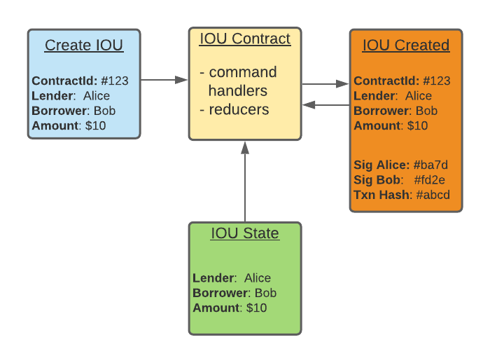

# CordaES

So what is this repo about? I work for R3 and while we have great DLT with [Corda](https://www.corda.net/), its not always easy 
to model business processes as smart contracts (CorDapps). 
This little experiment asks a fundamental question: 

>**What happens if we drop the UTXO model?**

There is a lengthy discussion on the [pros and cons](https://www.corda.net/blog/rationale-for-and-tradeoffs-in-adopting-a-utxo-style-model]) 
of this decision here. This is at the heart of the Corda programming model when implementing contracts,
though not necessary at the heart of the ecosystem - a lot of functionality in Corda is 
there to "support" the contract and is actually not tightly coupled to the contract itself.  So in theory at least, if 
an alternative model has clear benefits over UTXO for some use cases, we should be able support both models on a common platform. 

The proposal is to drop UTXO in favour of a simple event log and derive all state from a reduction of the 
events associated with the contract. The principles borrow heavily from thinking behind the [Actor](https://en.wikipedia.org/wiki/Actor_model), 
[event sourcing]([https://martinfowler.com/eaaDev/EventSourcing.html) and [CQRS](https://martinfowler.com/bliki/CQRS.html) 
patterns updated for the DLT world. 

To explain a little further, take the [IOU example](https://docs.corda.net/docs/corda-os/4.6/hello-world-introduction.html). 
We think about the problem a little differently - there is now no IOUState as such. Instead the IOUContract has two concepts. 
* command handlers to validate the request to update the contract, and if accepted generate signed event(s) with the 
update
* reducers that read the history of all events associated with the contract to build a view    

The diagram below hopefully makes it a little clear. I've skipped the distributed part for simplicity (moving data between nodes,
signing and agreeing concensus) to leave just a single node, and I've used the [event storming](https://github.com/wwerner/event-storming-cheatsheet) 
conventions for colouring. 

 

In some ways this is still very similar to the existing UTXO contract. For example:
* there are still commands to enforce the contract rules when the state for a contract is modified.
* all parties need to agree on final ledger change and sign over the same event.
* there is still a transaction linking one or more events into a single atomic transaction on the ledger. 
* there are still many independent chains within the ledger that only require knowledge of each other if 
they are combined in a transaction.    

But in other ways it is very different:
* events only hold the data explicitly required for the modification requested. this becomes more obvious once we start
looking at changing this data.
* all contracts will need to implement one or more "reducers" that read the events back into a view, e.g the current state 
of the IOU once payments and possible change of ownership are considered.

But most importantly, there is no explicit IOUState on the ledger. Instead there is an instance of the IOUContract 
on the ledger associated to the "ContractId" of "#123". All that matters is that this id is unique, i.e. there can be 
no event for this contract on the ledger as it responsible for issuing a new IOU to the ledger 

This has may implications, most of which I suspect are good - simply as in my experience it easier and more efficient 
to rationailise complicated problems in the world of events.

To be continued.....

 
   

 